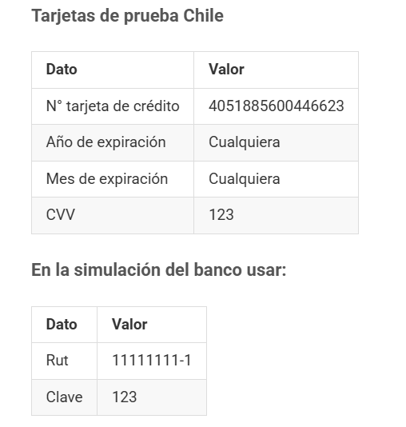

# 🚀 API de Citas Médicas

# Requerimientos:

## Objetivo: 

Realizar una API Restfull haciendo uso de POO, con endpoints que permitan lo siguiente: 
- Pedir cita médica (al paciente) 
- Pagar cita para confirmar asistencia (al paciente) (Implementar una pasarela de pago con ambiente sandbox) 
- Confirmar cita (al médico) (Validar que la cita esté pagada para confirmarla) 
- Listar mis citas del día (al médico) 
- Correlación de citas por paciente. (Agenda) (El horario de atención es de 7:00 a 12:00 y de 14:00 a 18:00) 

## Parámetros: 

Imaginar los parámetros necesarios de cada endpoint. Campos comunmente usados para una cita médica. 

## Roles y Permisos de usuario: 

- Paciente, únicamente pedirá cita. 
- Médico, podrá confirmar la cita o rechazarla de acuerdo.  
- Podrá gestionar sus citas. 

## Validaciones: 

- No se puede pedir cita en un horario no permitido. 
- No se puede pedir cita en un horario ya ocupado. 
- No se puede confirmar una cita que no ha sido pagada. 
- Otras validaciones que se consideren necesarias. 


## Seguridad y autenticación: 

Implementar un sistema de autenticación simple, puede ser un token en la URL o un token en  el header de la petición. 
No es necesario implementar un sistema de autenticación complejo. 

## Base de datos: 

Utilizar MariaDB, MySQL, PostgreSQL o MongoDB. Crear las tablas necesarias para el funcionamiento de la API.  Se debe entregar el script de creación de la base de datos. 

## Entrega: 

Se debe entregar el código fuente de la API, el script de creación de la base de datos y un archivo README.md con las instrucciones de uso. 

## Desarrollo, Se evaluará: 

- La calidad y arquitectura del código. 
- La estructura del proyecto. 
- Uso de Patrones de diseño. 
- Uso de principios SOLID. 
- Uso de gestor de dependencias. 
- Uso de control de versiones. 
- Pruebas unitarias. 
- Documentación del código. 
- Uso de comentarios en el código. 
- Uso de buenas prácticas de programación. 
- Uso de buenas prácticas de seguridad. 

# 🛠️ Tecnologías Utilizadas

- **[laravel](https://laravel.com/docs/8.x)**: Framework de Laravel en su ultima versión.
- **[PostgreSQL](https://www.postgresql.org/)**: Sistema de gestión de bases de datos relacional.
- **[Nginx](https://www.nginx.com/)**: Servidor web y proxy inverso.
- **Docker**: Para la contenerización y fácil despliegue.

# 📂 Repositorio

El código fuente está disponible en [Github](https://github.com/jeancarlos110295/citas-medicas).

# 📋 Requisitos

- Docker (La más reciente)
- Docker Compose (La más reciente)

# Configuración

## Docker

1. Crear archivo `.env`: `cp .env.example .env`
2. Configurar las siguientes variables:
    - Nombre Base de datos: POSTGRES_DB
    - Usuario Base de datos: POSTGRES_USER
    - Clave Base de datos: POSTGRES_PASSWORD
    - Puerto Base de datos: POSTGRES_PORT


## Laravel

1. Navegar al directorio del proyecto: `cd api`.
2. Crear archivo `.env`: `cp .env.example .env`
    - Nombre BD : DB_DATABASE
    - Usuario BD : DB_USERNAME
    - Clave BD : DB_PASSWORD
    - Puerto DB : DB_PORT
    - Host DB : DB_HOST


# 🚀 Instalación en docker

1. Correr contenedores:

```bash
    docker-compose up -d --build
```

2. Ingresar al contenedor:
```bash
    docker exec -it container_citas_medicas_app bash
```

3. Instalar dependencias de laravel:
```bash
    composer install 
```

4. Limpiar laravel y ejecutar migraciones:
```bash
    php artisan config:clear &&
    php artisan route:clear &&
    php artisan view:clear &&
    php artisan migrate &&
    php artisan db:seed
```

# Desinstalación

1. Eliminar contenedores del proyecto:

```bash
    docker-compose down --volumes --remove-orphans && docker image rmi citas_medicas_app:latest
```

# Configuraciones antes de usar la API

## Configurar NGROK

En el archivo .env, se debe configurar lo siguiente:

- NGROK_AUTHTOKEN=""

En donde el token se obtiene desde, [Authtoken](https://dashboard.ngrok.com/get-started/your-authtoken).

Despues se debe acceder a la siguiente url: http://localhost:4040

En donde se debe obtener la URL creada, por ejemplo: https://510e-190-22-194-46.ngrok-free.app

Configurar la URL en:

1. ´api/.env´ : "APP_URL".

2. ´postman/Citas Medias Prueba Tecnica.postman_environment.json´ : Buscar ("key": "URL"), y reemplazar "value".


## Configurar Flow

En el archivo ´api/.env´, configurar lo siguiente:

- FLOW_API_KEY=""

- FLOW_SECRET_KEY=""

Esta información, se obtiene desde:

1. [Mis datos](https://sandbox.flow.cl/app/web/misDatos.php)
2. Integración
3. Copiar "Api Key" y pegar en "FLOW_API_KEY"
4. Copiar "Secret Key" y pegar en "FLOW_SECRET_KEY"

### Metodos de pago de prueba

Se puede seleccionar cualquier medio de pago, utilizando las credenciales que proporciona flow.

[Realizar pruebas en nuestro ambiente Sandbox](https://sandbox.flow.cl/docs/api.html#section/Introduccion/Realizar-pruebas-en-nuestro-ambiente-Sandbox)


# Como consumir la API

Se debe utilizar Postman. En donde se debe importar los exports ubicados en ´postman´.

## Usuarios

1. Registrar un usuario, consumiendo el request "store"

    En donde se debe registrar los medicos y despues los pacientes.

## Auth

1. Login de usuarios

    - Crear 1 cita utlizando x paciente
    - Copiar el valor de "token", ejemplo: Bearer 1|1gcbYn1DsMWJwxBgbQNnEhx4OjGiVlhzpUwZWRxC
    - Actualizar la variable de postman "TOKEN", con el token copiado

## Citas

1. Crear cita, consumiendo el request "store"

    - Obtener el id del usuario medico
    - Reemplazar "user_id_medico", con el id del usuario medico
    - Copiar el id de la cita

## Pagos

1. Aca es importante haber configurado bien ngrok, ya que flow se conectara por la url expuexta a internet.

    - Modificar la url: {{URL}}/pagos/{ID_CITA}/pago
    - Reemplazar {ID_CITA}, con el id de la cita copiado
    - Crear el pago consumiendo el request 'store'
    - Ingresar a la url: data.url_pago, ejemplo (https://sandbox.flow.cl/app/web/pay.php?token=045FCA99D0958063A1F40096D72571946803D60R)
    - Seleccionar el primer metodo de pago
    - Continuar con el flujo de pago utilizando los datos en la imagen
    
    - Si todo sale ok, debera ver una respuesta json

## Medico/Citas

>Iniciar sesión como medico

1.  Listar mis citas del día como medico

    - Consumir la request "index"

2. Ver una cita

    - Consumir la request "show"
    - Modificar la url: {{URL}}/medicocitas/{ID_CITA}
    - Reemplazar {ID_CITA}, con el id de la cita copiado

3. Confirmar pago

    - Consumir la request "confirmar_pago"
    - Modificar la url: {{URL}}/medicocitas/{ID_CITA}
    - Reemplazar {ID_CITA}, con el id de la cita copiado
    - El valor de "estado_id", debe ser 3